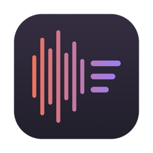

# VoiceVault

**Turn your Apple Voice Memos into a searchable, linked Obsidian vault — entirely on your Mac, no terminal, nothing leaves your machine.**

I built this because my best thinking happens on walks, talking into my phone, and then it dies there. Voice Memos is a wonderful capture tool and a terrible retrieval tool: a pile of recordings with vibes-based titles, where finding an idea means remembering which memo it was in, opening it, hitting View Transcript, and scrolling. I was never going to do that. All of my actual retrieval — searching, linking, rediscovering — happens in Obsidian.

VoiceVault bridges the two. Every memo becomes one Markdown note: the full verbatim transcript, a short summary, key-point bullets, suggested tags, and `[[links]]` to the people you mention. You review each note before it's written. Your recordings never leave the machine.

This was built to solve my own problem. If you have the same one, it's yours too.

## What a note looks like

```markdown
---
title: "yc of amsterdam AWESOME"
created: 2026-06-14T09:12:44Z
duration: "12:03"
type: voice-memo
transcription: apple-speechanalyzer
x-suggested-tags: [startups, europe, community-building]
x-suggested-people: [Suren]
x-name-corrections: ["Soren → Suren"]
---

## Summary

A riff on why Amsterdam has the ingredients for a serious startup scene
and nobody organizing them. The core idea is a YC-style batch program...

- Amsterdam has the technical talent but no forcing function
- A batch program could be the forcing function
- Suren knows the people who could fund a pilot

People: [[Suren]]

---

## Transcript

So I keep coming back to this idea about Amsterdam...
```

## Installing it

You need a Mac running macOS 26 (Tahoe) on Apple Silicon. You do not need to know what a terminal is.

1. Download `VoiceVault-1.0.0.zip` from the [latest release](../../releases/latest) and double-click it to unpack.
2. Drag **VoiceVault** into your Applications folder.
3. **First launch, important:** I haven't paid Apple for a developer certificate yet, so macOS will refuse to open the app the normal way. This is Apple being cautious about unsigned software, not an error. The dance:
   - **Right-click** (or hold Control and click) on VoiceVault → choose **Open**.
   - If macOS still refuses: open **System Settings → Privacy & Security**, scroll down, and next to the message about VoiceVault click **Open Anyway**.
   - You only do this once. Every launch after that is a normal double-click.

The app walks you through the rest: pointing it at your Voice Memos, choosing where notes go, and setting up the local AI. The one-time downloads (Apple's speech model, the summarizer engine and model) total a few gigabytes; after that it works on a plane.

## The privacy deal, plainly

- Transcription is Apple's on-device SpeechAnalyzer — the same engine behind Voice Memos' own transcripts.
- Summaries come from a local model served by [Ollama](https://ollama.com), running on your Mac. VoiceVault installs and manages it for you.
- The app makes **no network connections** except to download those models. No account, no analytics, no telemetry, nothing phones home.
- Your Voice Memos library is opened read-only. VoiceVault never moves, edits, or deletes a recording.
- Every note is shown to you in full before it's written anywhere.

I recorded things into Voice Memos that I would not paste into a chatbot. That standard is the whole reason this app exists.

## The practice: how to get the most out of it

The app is the easy half. The other half is recording memos that your future self can actually find. Two habits changed everything for me.

**One idea per memo.** The unit of retrieval is the note. A 40-minute ramble that mixes a project idea, a relationship reflection, and a grocery list becomes one note that is about nothing. Stop the recording when the idea ends and start a new one when the next begins — you get atomic notes that can be linked, tagged, and found on their own terms. This is the same principle behind Zettelkasten's atomic notes, arrived at from the voice side.

**Say the metadata out loud.** The summarizer can only work with what you said. If a memo relates to a project, name the project. If you're talking about a person, use their name instead of "she." I'll even say "this connects to my idea about spaced repetition" mid-memo — that sentence costs three seconds and becomes a link forever.

### LATCH, or why this beats scrolling

Richard Saul Wurman's observation in *Information Anxiety* is that there are only five ways to organize anything: **L**ocation, **A**lphabet, **T**ime, **C**ategory, and **H**ierarchy. The Voice Memos app gives you exactly one of them — time — and that's why your recordings are a graveyard. You don't remember *when* you had an idea; you remember what it was about, who it involved, what it connects to.

Each note VoiceVault writes is retrievable along every axis:

| Axis | Where it lives in the note |
|---|---|
| Location | Frontmatter is ready for a `location` field; folder placement in your vault |
| Alphabet | Real titles as filenames — searchable, sortable |
| Time | `created` timestamp, preserved from the recording |
| Category | `x-suggested-tags`, the `type: voice-memo` marker |
| Hierarchy | `[[people]]` links and whatever structure your vault already has |

The tags and people are deliberately prefixed `x-suggested-` — they're the model's proposal, not gospel. My own workflow is to skim the note, promote the good suggestions to real tags, and delete the rest. The model does the tedious 90%; taste stays yours.

## Fixing mangled names

Apple's transcriber is very good at one voice and very bad at your friends. My friend Suren comes out as "Soren," Isa becomes "Issa," Sosnovsky becomes "Sasnowski" — which doesn't just look wrong, it breaks retrieval, because a `[[Suren]]` link and a "Soren" transcript never find each other.

VoiceVault fixes this with a **People list** (Settings → People). Add the names you actually say, and three things happen:

1. The names are fed to Apple's recognizer as hints before transcription.
2. A conservative phonetic pass corrects near-miss spellings in the transcript. It matches on sound and edit distance, refuses to touch everyday English words (so "is a" can never become "Isa"), and logs every fix in the note's frontmatter — you always see what changed.
3. The summarizer is told the canonical spellings, so `[[links]]` come out right.

If the transcriber keeps inventing a specific mishearing, add it as a known alias and it's corrected on sight.

## Making it yours

Both halves of the summarization are yours to change in Settings, no code involved:

- **The model.** Anything Ollama serves. `qwen3.5` (the default) gives the best summaries; `llama3.2:3b` is a 2 GB download that's fine for short memos. Download and switch models inside the app.
- **The prompt.** The full instruction the model receives is an editable text box. Want the summary in Spanish, bullets in a different style, an extra frontmatter field for your own system? Edit the prompt. There's a Restore Default button, so experiment freely.

Enrichments (tags, people links, key points) toggle individually, and you can optionally copy each memo's audio into the vault next to its note — off by default, because the vault works better as text and the audio already lives in Voice Memos.

## Troubleshooting

**"VoiceVault doesn't have permission to read…"** — macOS guards the Voice Memos library closely. Click "Grant access" and select the folder the app points you at; if macOS still refuses, give VoiceVault Full Disk Access in System Settings → Privacy & Security → Full Disk Access, then click Refresh.

**A recording says "audio not downloaded."** iCloud has offloaded the file. Open that memo once in Voice Memos to pull it down, then Refresh.

**Summaries fail but transcripts work.** The local AI engine isn't running or the model isn't downloaded — Settings → Summarizer shows the state and can fix it. Notes still get their full transcript either way, marked `status: transcript-only`, and you can re-process them later.

**A name got "corrected" that shouldn't have been.** Remove it from People, or make the spelling in the transcript an explicit person of its own. The correction rules are conservative on purpose, but no phonetic matcher is perfect — which is why every fix is logged in frontmatter and shown at review.

## For the technically inclined

The repo is a plain SwiftPM package — no Xcode project. `Scripts/build_app.sh` builds and assembles `VoiceVault.app` (ad-hoc signed by default; set `SIGNING_IDENTITY` for a real certificate). `Scripts/test.sh` runs the unit tests. `poc/vm_to_markdown.py` is the original command-line proof of concept this grew from, kept for reference and for people who *do* like terminals.

Architecture in one breath: `VoiceVaultCore` (library — Voice Memos database reader, SpeechAnalyzer transcription, phonetic name correction, Ollama client, Markdown rendering) plus a SwiftUI app on top. The design doc lives in `docs/specs/`.

## License

MIT. Built by [Krish Ramkumar](https://github.com/krishramkumar06) to solve his own problem, offered to anyone with the same one.
